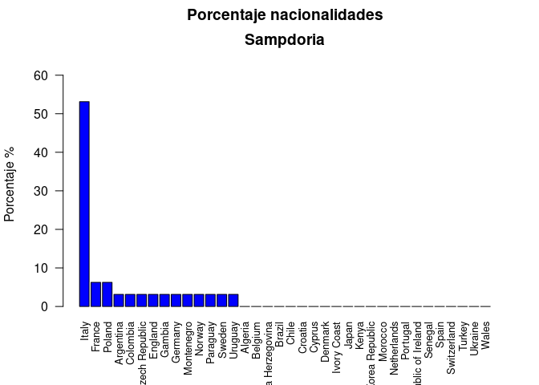

# Taller evaluable datos FIFA 2020

Registraros en kaggle y bajaros  el data set [FIFA 2020  Datos completos 2015 a 2020](https://www.kaggle.com/stefanoleone992/fifa-20-complete-player-dataset).
Guarda los datos en una carpeta FIFA2020.

Las siguientes preguntas son relativas al data set `players_20.csv`. 

Hay que contestar con código R explicar muy brevemente cada salida. Subid a la activada el Rmd y el html. 


Rellenad estos datos:

**PONED NOMBRE DEL GRUPO**


*  Apellidos, Nombre Alumno 

## Pregunta 0

Explica  el data set y de qué tipo son cada una de las variables y  en qué tipo de  fichero están guardadas.  Carga los datos  en un data frame  con `read.csv` y explica las clases de cada columna de datos.  Explica  el parámetro `encoding`.
Es un data frame de 18278 observaciones (filas)  y 104 variables (columna).

Carga las  variables de texto como factor
### Solución


```r
datos = read.csv("FIFA2020/players_20.csv",
  encoding="UTF-8",stringsAsFactors = TRUE)# cambia tu path
#str(datos)
#names(datos)
```

Las variables de la 1 (`sofifa_id`) a la 31(`nation_jersey_number`) son variables de perfil del jugador: su nombre, su  equipo su sueldo su número de camiseta... El resto de variables de la 32 (`pace`) a la 104 (`rb`) son variables numéricas  enteras con valores de 0 a 100 que parametrizan cómo es el jugador el el juego FIFA player 2020  


##  Pregunta 1

¿Qué 6  clubs tienen a los 10 mejores jugadores según la variable  "shooting"?


### Solución
La solución más adecuada es escoger  los 10 mejores primeros jugadores por  la variable `shooting` los 6 primeros clubs. Pero como pueden  el Barça  tiene dos juradores entre los 10 primeros hay que tomar los 6 mejores entre los  clubs de los 10 mejores jugadores en `shooting` sin repetir; eso lo conseguimos con la función `unique` o simplemente construyendo la lista  ala vista de los clubs de de los 10 mejores jugadores por `shooting` .

Se  dará por correcta cualquier combinación de 6 clubs entre los  clubs de los  10 mejores jugadores por tiro a puerta `shooting`.


```r
datos_o=datos[order(datos$shooting,decreasing=TRUE),]
datos_o$shooting[1:10]
```

```
##  [1] 93 92 91 90 89 89 88 88 87 87
```

```r
datos_o$long_name[1:10]
```

```
##  [1] Cristiano Ronaldo dos Santos Aveiro Lionel Andrés Messi Cuccittini     
##  [3] Harry Kane                          Sergio Leonel Agüero del Castillo  
##  [5] Luis Alberto Suárez Díaz            Fabio Quagliarella                 
##  [7] Marco Reus                          Zlatan Ibrahimović                 
##  [9] Robert Lewandowski                  Gareth Frank Bale                  
## 18218 Levels: A. Benjamin Chiamuloira Paes A. Pimenta Flora Pimenta ... 龙成
```

```r
datos_o$club[1:10]
```

```
##  [1] Juventus          FC Barcelona      Tottenham Hotspur Manchester City  
##  [5] FC Barcelona      Sampdoria         Borussia Dortmund LA Galaxy        
##  [9] FC Bayern München Real Madrid      
## 698 Levels:  SSV Jahn Regensburg 1. FC Heidenheim 1846 ... Zagłębie Lubin
```

```r
unique(datos_o$club)[1:10]
```

```
##  [1] Juventus          FC Barcelona      Tottenham Hotspur Manchester City  
##  [5] Sampdoria         Borussia Dortmund LA Galaxy         FC Bayern München
##  [9] Real Madrid       Liverpool        
## 698 Levels:  SSV Jahn Regensburg 1. FC Heidenheim 1846 ... Zagłębie Lubin
```

```r
club6 = unique(datos_o$club)[1:6]# así sacamos os 6 clubs o simplemente construyendo la lista
club6
```

```
## [1] Juventus          FC Barcelona      Tottenham Hotspur Manchester City  
## [5] Sampdoria         Borussia Dortmund
## 698 Levels:  SSV Jahn Regensburg 1. FC Heidenheim 1846 ... Zagłębie Lubin
```

Notad que guardamos los nombres de los 6 clubs en la variable `club6`.

## Pregunta 2

Crea un data frame `fifa20_best_shooting` que contenga a TODOS  los jugadores de los clubs encontrados en el ejercicio anterior.


### Solución

Construimos  el data frame `fifa20_best_shooting` utilizando la función `%in%`   (estaba en el ejemplo de solución del profesor del FIFA 2019). Se admite cualquier otra solución correcta.


```r
fifa20_best_shooting=datos[datos$club %in% club6,]
unique(fifa20_best_shooting$club)
```

```
## [1] FC Barcelona      Juventus          Manchester City   Tottenham Hotspur
## [5] Borussia Dortmund Sampdoria        
## 698 Levels:  SSV Jahn Regensburg 1. FC Heidenheim 1846 ... Zagłębie Lubin
```

## Pregunta 3

Calcular la media y la desviación típica   del sueldo de cada equipo del data frame `fifa20_best_shooting`. 


### Solución

Es una caso  típico de uso de la función `aggregate` (es una función clásica) está en el [capítulo de data frames de AprendeR1](https://aprender-uib.github.io/AprendeR1/chap-df.html).


```r
aggregate(wage_eur~club, data=fifa20_best_shooting,
          FUN=function(x){c(media=mean(x),
                            desv.tip=sd(x),
                            mínimo=min(x),
                            máximo=max(x))})
```

```
##                club wage_eur.media wage_eur.desv.tip wage_eur.mínimo
## 1 Borussia Dortmund       57806.45          43276.95         1000.00
## 2      FC Barcelona      150000.00         130914.81        12000.00
## 3          Juventus      113636.36          77462.42        17000.00
## 4   Manchester City      120727.27          99257.01         1000.00
## 5         Sampdoria       18781.25          11686.04         3000.00
## 6 Tottenham Hotspur       78878.79          60960.42         1000.00
##   wage_eur.máximo
## 1       170000.00
## 2       565000.00
## 3       405000.00
## 4       370000.00
## 5        46000.00
## 6       220000.00
```


## Pregunta 4

Discretiza la variable `age` de  `fifa20_best_shooting` en los 3 niveles siguientes: "freshman", "junior", "senior", según los cortes por defecto. La variable resultante age_Level tiene que ser un factor ordenado en orden creciente de edad. 


### Solución


 En el tema [Datos cuantitativos agrupados de AprendeR1](https://aprender-uib.github.io/AprendeR1/chap-hist.html) se explica como agrupar variables continuas por intervalos. En este caso nos piden la solución por defecto de la función `cut`en  3 `breaks` y luego hay que transformarla a  un factor ordenado con los `levels` "freshman", "junior", "senior".


```r
age3=ordered(cut(fifa20_best_shooting$age,breaks=3))# corto en tres  partes
fifa20_best_shooting$age[1:10]
```

```
##  [1] 32 34 28 27 25 34 31 32 30 28
```

```r
age3[1:10]
```

```
##  [1] (25,33] (33,41] (25,33] (25,33] (17,25] (33,41] (25,33] (25,33] (25,33]
## [10] (25,33]
## Levels: (17,25] < (25,33] < (33,41]
```

```r
table(age3)
```

```
## age3
## (17,25] (25,33] (33,41] 
##     120      67       8
```

```r
class(age3)
```

```
## [1] "ordered" "factor"
```

```r
str(age3)
```

```
##  Ord.factor w/ 3 levels "(17,25]"<"(25,33]"<..: 2 3 2 2 1 3 2 2 2 2 ...
```

```r
levels(age3)<- c("freshman", "junior", "senior")
table(age3)
```

```
## age3
## freshman   junior   senior 
##      120       67        8
```

## Pregunta 5

¿Qué club tiene a más jugadores en el nivel "senior" calculado en el ejercicio anterior?


### Solución 


```r
table(droplevels(fifa20_best_shooting$club),age3)
```

```
##                    age3
##                     freshman junior senior
##   Borussia Dortmund       20     10      1
##   FC Barcelona            21     12      0
##   Juventus                14     16      3
##   Manchester City         23      8      2
##   Sampdoria               22      8      2
##   Tottenham Hotspur       20     13      0
```

 Es el Juventus con  3 jugadores `senior`. Notad que utilizamos la función `droplevels` para eliminar  niveles de  la variable club que no aparecen en  el data frame `fifa20_best_shooting`.
 

## Pregunta 6

¿Cuántas nacionalidades hay entre todos los jugadores de `fifa20_best_shooting`? ¿Qué club tiene mayor cantidad de nacionalidades?


### Solución


```r
length(levels(fifa20_best_shooting$nationality))
```

```
## [1] 162
```

```r
length(levels(fifa20_best_shooting$nationality))
```

```
## [1] 162
```

```r
length(unique(droplevels(fifa20_best_shooting$nationality)))
```

```
## [1] 36
```

Con esto sabemos que hay 36 nacionalidades distintas entre los 6 clubs.
Notemos que hemos combinado `droplevels`y `unique `para obtener el resultado correcto.


Ahora contar las nacionalidades por club es un poco más delicado. Podemos hacer la tabla de nacionalidades por club (como siempre con el `droplevels`)


```r
knitr::kable(
  t(table(droplevels(
    fifa20_best_shooting$club),
          droplevels(
            fifa20_best_shooting$nationality)
    )
    ))# notad que transpongo la tabla 
```


|                    | Borussia Dortmund| FC Barcelona| Juventus| Manchester City| Sampdoria| Tottenham Hotspur|
|:-------------------|-----------------:|------------:|--------:|---------------:|---------:|-----------------:|
|Algeria             |                 0|            0|        0|               1|         0|                 0|
|Argentina           |                 1|            1|        2|               3|         1|                 4|
|Belgium             |                 2|            0|        0|               1|         0|                 2|
|Bosnia Herzegovina  |                 0|            0|        1|               0|         0|                 0|
|Brazil              |                 0|            3|        4|               3|         0|                 1|
|Chile               |                 0|            1|        0|               1|         0|                 0|
|Colombia            |                 0|            0|        1|               0|         1|                 1|
|Croatia             |                 0|            1|        2|               0|         0|                 0|
|Cyprus              |                 0|            0|        0|               0|         0|                 2|
|Czech Republic      |                 0|            0|        0|               0|         1|                 0|
|Denmark             |                 2|            0|        0|               0|         0|                 1|
|England             |                 1|            0|        0|               8|         1|                13|
|France              |                 2|            5|        3|               3|         2|                 4|
|Gambia              |                 0|            0|        0|               0|         1|                 0|
|Germany             |                15|            1|        2|               2|         1|                 0|
|Italy               |                 0|            0|       12|               0|        17|                 0|
|Ivory Coast         |                 0|            0|        0|               0|         0|                 1|
|Japan               |                 0|            1|        0|               0|         0|                 0|
|Kenya               |                 0|            0|        0|               0|         0|                 1|
|Korea Republic      |                 0|            0|        0|               0|         0|                 1|
|Montenegro          |                 0|            0|        0|               0|         1|                 0|
|Morocco             |                 1|            0|        0|               0|         0|                 0|
|Netherlands         |                 0|            2|        1|               0|         0|                 0|
|Norway              |                 0|            0|        0|               0|         1|                 0|
|Paraguay            |                 0|            0|        0|               0|         1|                 0|
|Poland              |                 1|            0|        1|               0|         2|                 0|
|Portugal            |                 1|            1|        1|               2|         0|                 0|
|Republic of Ireland |                 0|            0|        0|               2|         0|                 1|
|Senegal             |                 0|            1|        0|               0|         0|                 0|
|Spain               |                 2|           15|        0|               5|         0|                 0|
|Sweden              |                 0|            0|        0|               0|         1|                 0|
|Switzerland         |                 3|            0|        0|               1|         0|                 0|
|Turkey              |                 0|            0|        1|               0|         0|                 0|
|Ukraine             |                 0|            0|        0|               1|         0|                 0|
|Uruguay             |                 0|            1|        1|               0|         1|                 0|
|Wales               |                 0|            0|        1|               0|         0|                 1|

```r
# como si fuera una matriz con la función t.
```


y  luego marcar las nacionalidades $>0$ con una variable lógica y acumular la tabla por filas con `rowSums`.


```r
nac_por_club=table(droplevels(fifa20_best_shooting$club),droplevels(fifa20_best_shooting$nationality))
aux=nac_por_club>0
rowSums(aux)
```

```
## Borussia Dortmund      FC Barcelona          Juventus   Manchester City 
##                11                12                14                13 
##         Sampdoria Tottenham Hotspur 
##                14                13
```

Así obtenemos el número de nacionalidades por club.


## Pregunta 7

Calcula mediante un diagrama de barras ordenado de mayor a menor la proporción de jugadores de cada nacionalidad en cada club


### Solución

He viso innumerables soluciones. Si habéis conseguido las gráficas correctas y pues to el título  las puntuaremos como correctas.

Yo doy esta solución  (he utilizado un `for` que es  del tema [Estructuta de control básicas de AprendeR1](https://aprender-uib.github.io/AprendeR1/chap-for.html))


Construyo una función que me da la nacionalidad por club  y dibujo los `barplot` con el título y nombres adecuados.


```r
porcen_nac_por_club=100*prop.table(nac_por_club,margin=1)
nombre_club=as.character(club6)
nombre_club
```

```
## [1] "Juventus"          "FC Barcelona"      "Tottenham Hotspur"
## [4] "Manchester City"   "Sampdoria"         "Borussia Dortmund"
```

```r
for(i in 1:6){
  alturas=sort(porcen_nac_por_club[i,],decreasing=TRUE)
barplot(alturas,
        ylim=c(0,max(alturas)+10),
               las=2,cex.names=0.8,ylab="Porcentaje %",
        main=paste0(c("Porcentaje nacionalidades\n",nombre_club[i])),col="blue")
}
```

<!-- --><!-- --><!-- --><!-- --><!-- --><!-- -->

```r
# paste0  concatena  caracteres sin espacio, paste es la función general
```


## Pregunta 8

Encuentra la función (lineal, exponencial o potencial) que mejor describe la dependencia funcional del sueldo de los jugadores en función de la variable `shooting` en el data frame `fifa20_best_shooting`. Representa dicha función junto con los puntos (shooting, sueldo) en escala lineal.

### Solución


Hay que seguir los pasos de la lección [Un aperitivo: Introducción a la regresión linea: AprendeR1](https://aprender-uib.github.io/AprendeR1/chap-lm.html)


```r
summary(lm(wage_eur~shooting,data=fifa20_best_shooting))$r.squared # lineal
```

```
## [1] 0.3650403
```

```r
summary(lm(log10(wage_eur)~log10(shooting),data=fifa20_best_shooting))$r.squared # potencial
```

```
## [1] 0.3334074
```

```r
summary(lm(log10(wage_eur)~shooting,data=fifa20_best_shooting))$r.squared # exponencial
```

```
## [1] 0.3668289
```

El mejor modelo es  el que tenga mejor $r.squared$ que es (por muy muy poco ) el exponencial


```r
lm(log10(wage_eur)~shooting,data=fifa20_best_shooting)
```

```
## 
## Call:
## lm(formula = log10(wage_eur) ~ shooting, data = fifa20_best_shooting)
## 
## Coefficients:
## (Intercept)     shooting  
##     3.35568      0.02199
```


luego 


$$\log_{10}(wage\_eur)=  0.02418 \cdot shooting + 3.15960.$$
$$wage\_eur=  10^{3.15960}\cdot  10^{0.02418\cdot shooting}  .$$


Simplificando $10^{0.02418}\approx1.0573$ y $10^{0.02418}\approx1444.1091$. Luego el modelo exponencial es 

$$wage\_eur=  1444.1091\cdot 1.0573^{shooting}.$$


Con estos datos podemos dibujar la gráfica con la curva y los datos


```r
potencial=function(x) {1444.1091* 1.0573^x}
plot(fifa20_best_shooting$shooting,fifa20_best_shooting$wage_eur,
     xlim=c(0,100),ylab="wage_eur",xlab="shooting",main="Curva potencial entre wage_eur y shooting")
curve(potencial(x),col="red",add = TRUE,xlim=c(0,100))
```

<!-- -->


