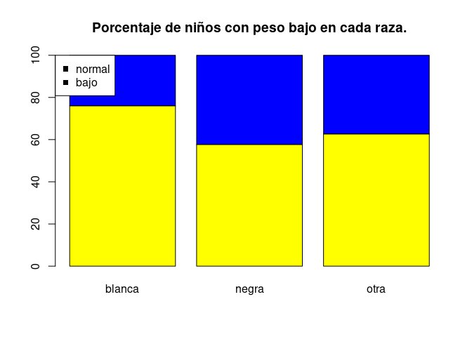
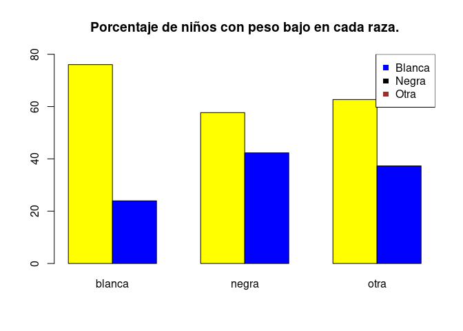
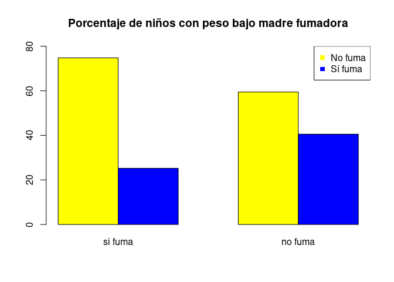
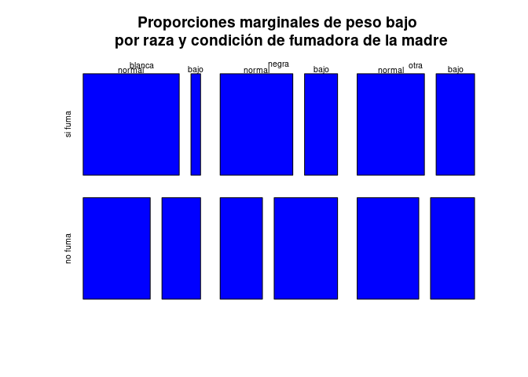
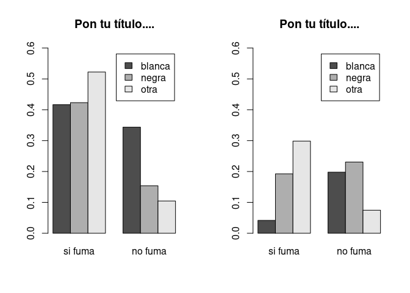
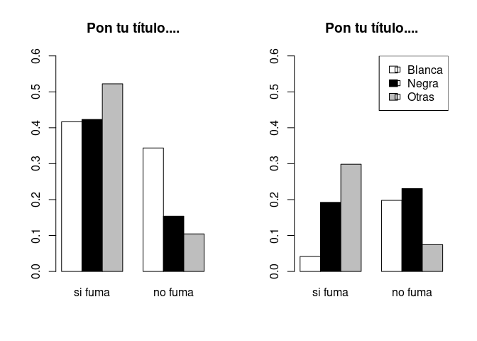

# Enunciado

Instalad y cargad el paquete MASS. Este paquete lleva una tabla de datos llamada birthwt sobre factores que pueden incidir en el peso de los niños al nacer. Antes de empezar, con str, View, head … explorad su estructura y consultad en su Ayuda el significado de cada variable.

1. Calculad una tabla bidimensional de frecuencias relativas marginales de los pares (raza de la madre, peso inferior a 2.5 kg o no) que permita ver, fácilmente, si la raza de la madre influye en el peso del bebé. Dibujad un diagrama de mosaico de esta tabla.

2. Asimismo, dibujad un diagrama de barras por bloques e estas frecuencias relativas que permita visualizar esta información. Poned nombres adecuados a los bloques, colores a las barras, y añadid una leyenda que explique qué representa cada barra. ¿Se puede obtener alguna conclusión de esta tabla y de este diagrama de barras?

3. Repetid el punto anterior para los pares (madre fumadora o no, peso inferior a 2.5 kg o no) y para los pares (madre hipertensa o no, peso inferior a 2.5 kg o no).

4. Calculad una tabla de frecuencias relativas marginales de las ternas (raza de la madre, madre fumadora o no, peso inferior a 2.5 kg o no) que permita ver, fácilmente, si la combinación de la raza de la madre y su condición de fumadora o no fumadora influye en el peso del bebé. Dibujad un diagrama de mosaico de esta tabla tridimensional.

5. Dibujad un diagrama de barras por bloques que permita visualizar esta información (pensad cómo pasaréis de la tabla tridimensional a un diagrama de barras bidimensional que muestre la información deseada). Poned nombres adecuados a los bloques, colores a las barras, y añadid una leyenda que explique qué representa cada barra. ¿Se puede obtener alguna conclusión de esta tabla y de este diagrama de barras?

#  Solución


Instalad y cargad el paquete MASS. Este paquete lleva una tabla de datos llamada birthwt sobre factores que pueden incidir en el peso de los niños al nacer. Antes de empezar, con str, View, head … explorad su estructura y consultad en su Ayuda el significado de cada variable.


```r
#descomentar para instalar 
#install.packages("MASS")
library(MASS)
```


```r
#help(birthwt)
```

Extracto del help   suentes de datos Venables, W. N. and Ripley, B. D. (2002) Modern Applied Statistics with S. Fourth edition. Springer. que asu vez cita a 
Hosmer, D.W. and Lemeshow, S. (1989) Applied Logistic Regression. New York: Wiley

```
Usage
birthwt
Format
This data frame contains the following columns:

low
indicator of birth weight less than 2.5 kg.

age
mother's age in years.

lwt
mother's weight in pounds at last menstrual period.

race
mother's race (1 = white, 2 = black, 3 = other).

smoke
smoking status during pregnancy.

ptl
number of previous premature labours.

ht
history of hypertension.

ui
presence of uterine irritability.

ftv
number of physician visits during the first trimester.

bwt
birth weight in grams.

Source
Hosmer, D.W. and Lemeshow, S. (1989) Applied Logistic Regression. New York: Wiley

References
Venables, W. N. and Ripley, B. D. (2002) Modern Applied Statistics with S. Fourth edition. Springer.

```

Exploramos la estructura de los datos


```r
str(birthwt)
```

```
## 'data.frame':	189 obs. of  10 variables:
##  $ low  : int  0 0 0 0 0 0 0 0 0 0 ...
##  $ age  : int  19 33 20 21 18 21 22 17 29 26 ...
##  $ lwt  : int  182 155 105 108 107 124 118 103 123 113 ...
##  $ race : int  2 3 1 1 1 3 1 3 1 1 ...
##  $ smoke: int  0 0 1 1 1 0 0 0 1 1 ...
##  $ ptl  : int  0 0 0 0 0 0 0 0 0 0 ...
##  $ ht   : int  0 0 0 0 0 0 0 0 0 0 ...
##  $ ui   : int  1 0 0 1 1 0 0 0 0 0 ...
##  $ ftv  : int  0 3 1 2 0 0 1 1 1 0 ...
##  $ bwt  : int  2523 2551 2557 2594 2600 2622 2637 2637 2663 2665 ...
```


```r
birthwt$low=factor(birthwt$low,labels=c("normal","bajo"))
birthwt$race=factor(birthwt$race,labels=c("blanca","negra","otra"))
birthwt$smoke=factor(birthwt$smoke,labels=c("si fuma","no fuma"))
birthwt$ht=factor(birthwt$smoke,labels=c("no hipertesión","sí hipertensión"))
str(birthwt)
```

```
## 'data.frame':	189 obs. of  10 variables:
##  $ low  : Factor w/ 2 levels "normal","bajo": 1 1 1 1 1 1 1 1 1 1 ...
##  $ age  : int  19 33 20 21 18 21 22 17 29 26 ...
##  $ lwt  : int  182 155 105 108 107 124 118 103 123 113 ...
##  $ race : Factor w/ 3 levels "blanca","negra",..: 2 3 1 1 1 3 1 3 1 1 ...
##  $ smoke: Factor w/ 2 levels "si fuma","no fuma": 1 1 2 2 2 1 1 1 2 2 ...
##  $ ptl  : int  0 0 0 0 0 0 0 0 0 0 ...
##  $ ht   : Factor w/ 2 levels "no hipertesión",..: 1 1 2 2 2 1 1 1 2 2 ...
##  $ ui   : int  1 0 0 1 1 0 0 0 0 0 ...
##  $ ftv  : int  0 3 1 2 0 0 1 1 1 0 ...
##  $ bwt  : int  2523 2551 2557 2594 2600 2622 2637 2637 2663 2665 ...
```


## Solución apartado 1

Calculad una tabla bidimensional de frecuencias relativas marginales de los pares (raza de la madre, peso inferior a 2.5 kg o no) que permita ver, fácilmente, si la raza de la madre influye en el peso del bebé. Dibujad un diagrama de mosaico de esta tabla.

**Solución**


```r
prop.table(table(birthwt$low,birthwt$race),margin = 2)
```

```
##         
##             blanca     negra      otra
##   normal 0.7604167 0.5769231 0.6268657
##   bajo   0.2395833 0.4230769 0.3731343
```

```r
100*prop.table(table(birthwt$low,birthwt$race),margin =2)
```

```
##         
##            blanca    negra     otra
##   normal 76.04167 57.69231 62.68657
##   bajo   23.95833 42.30769 37.31343
```

Explica qué son estas tablas...


## Solución apartado 2

Asimismo, dibujad un diagrama de barras por bloques de estas frecuencias relativas que permita visualizar esta información. Poned nombres adecuados a los bloques, colores a las barras, y añadid una leyenda que explique qué representa cada barra. ¿Se puede obtener alguna conclusión de esta tabla y de este diagrama de barras?


**Solución**

Primera opción  proporciones apiladas


```r
barplot(100*prop.table(table(birthwt$low,birthwt$race)
                       ,margin =2),col=c("yellow","blue"),
        main=c("Porcentaje de niños con peso bajo en cada raza."))
legend("topleft",pch=15,legend=c("normal","bajo"),c("yellow","blue"))
```

<!-- -->

Otra opcion  son las proporciones adosadas (beside)


```r
barplot(100*prop.table(table(birthwt$low,birthwt$race),margin =2),
        col=c("yellow","blue"),beside=TRUE,
        main=c("Porcentaje de niños con peso bajo en cada raza."),ylim=c(0,80))
legend("topright",pch=15,legend=c("Blanca","Negra","Otra"),
       col=c("blue","black","brown"))
```

<!-- -->


## Solución apartado 3

Repetid el punto anterior para los pares (madre fumadora o no, peso inferior a 2.5 kg o no) y para los pares (madre hipertensa o no, peso inferior a 2.5 kg o no).

**Solución**


```r
barplot(100*prop.table(table(birthwt$low,birthwt$smoke),margin =2),
        col=c("yellow","blue"),beside=TRUE,
        main=c("Porcentaje de niños con peso bajo madre fumadora"),ylim=c(0,80))

legend("topright",pch=15,legend=c("No fuma","Sí fuma"),
       col=c("yellow","blue"))
```

<!-- -->

Comentad el gráfico....


```r
barplot(100*prop.table(table(birthwt$low,birthwt$ht),margin =2),
        col=c("yellow","blue"),beside=TRUE,
        main=c("Porcentaje de niños con peso bajo madre hipertensa"),ylim=c(0,80))

legend("topright",pch=15,legend=c("No hipertensa","Sí hipertensa"),
       col=c("yellow","blue"))
```

<!-- -->

Comentad el gráfico....


## Solución apartado 4

Calculad una tabla de frecuencias relativas marginales de las ternas (raza de la madre, madre fumadora o no, peso inferior a 2.5 kg o no)
que permita ver, fácilmente, si la combinación de la raza de la madre y su condición de fumadora o no fumadora influye en el peso del bebé. Dibujad un diagrama de mosaico de esta tabla tridimensional.

**Solución**


```r
frecuencias_tabla_raza_fumar_peso=
  table(birthwt$race,birthwt$smoke,birthwt$low)
frecuencias_tabla_raza_fumar_peso
```

```
## , ,  = normal
## 
##         
##          si fuma no fuma
##   blanca      40      33
##   negra       11       4
##   otra        35       7
## 
## , ,  = bajo
## 
##         
##          si fuma no fuma
##   blanca       4      19
##   negra        5       6
##   otra        20       5
```

```r
proporciones_marginales_raza_fumar=
  prop.table(frecuencias_tabla_raza_fumar_peso,margin = c(1,2))
proporciones_marginales_raza_fumar
```

```
## , ,  = normal
## 
##         
##             si fuma    no fuma
##   blanca 0.90909091 0.63461538
##   negra  0.68750000 0.40000000
##   otra   0.63636364 0.58333333
## 
## , ,  = bajo
## 
##         
##             si fuma    no fuma
##   blanca 0.09090909 0.36538462
##   negra  0.31250000 0.60000000
##   otra   0.36363636 0.41666667
```


```r
plot(proporciones_marginales_raza_fumar,
     main="Proporciones marginales de peso bajo \n por raza y condición de fumadora de la madre",
     col="blue")
```

<!-- -->


```r
ftable(proporciones_marginales_raza_fumar)
```

```
##                     normal       bajo
##                                      
## blanca si fuma  0.90909091 0.09090909
##        no fuma  0.63461538 0.36538462
## negra  si fuma  0.68750000 0.31250000
##        no fuma  0.40000000 0.60000000
## otra   si fuma  0.63636364 0.36363636
##        no fuma  0.58333333 0.41666667
```


## Solución apartado 5 

Dibujad un diagrama de barras por bloques que permita visualizar esta información (pensad cómo pasaréis de la tabla tridimensional a un diagrama de barras bidimensional que muestre la información deseada). Poned nombres adecuados a los bloques, colores a las barras, y añadid una leyenda que explique qué representa cada barra. ¿Se puede obtener alguna conclusión de esta tabla y de este diagrama de barras?


**Solución**


```r
par(mfrow=c(1,2))
barplot(prop.table(frecuencias_tabla_raza_fumar_peso, margin=1)[,,1],
        beside=TRUE, legend.text=TRUE, ylim=c(0,0.6),main="Pon tu título....")
barplot(prop.table(frecuencias_tabla_raza_fumar_peso, margin=1)[,,2],
        beside=TRUE, legend.text=TRUE, ylim=c(0,0.6),main="Pon tu título....")
```

<!-- -->

```r
par(mfrow=c(1,1))
```

Otra forma


```r
par(mfrow=c(1,2))
barplot(prop.table(frecuencias_tabla_raza_fumar_peso, margin=1)[,,1],
        beside=TRUE, ylim=c(0,0.6),main="Pon tu título....",
        col=c("white","black","grey"))
barplot(prop.table(frecuencias_tabla_raza_fumar_peso, margin=1)[,,2],
        beside=TRUE, ylim=c(0,0.6),main="Pon tu título....",
        col=c("white","black","grey"))
legend("topright",pch=22,legend=c("Blanca","Negra","Otras"),
        fill=c("white","black","grey"))
```

<!-- -->

```r
par(mfrow=c(1,1))
```

